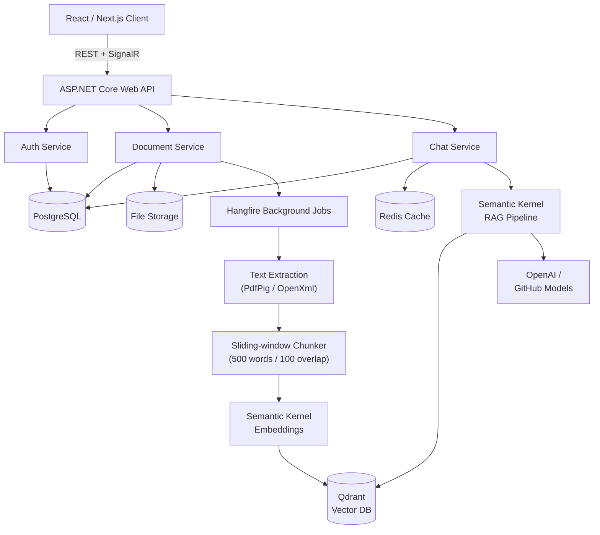
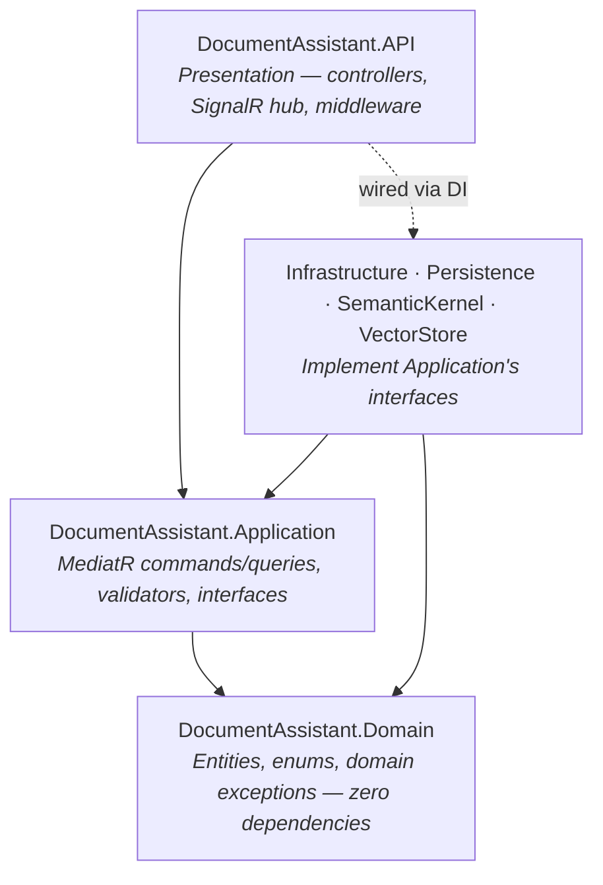
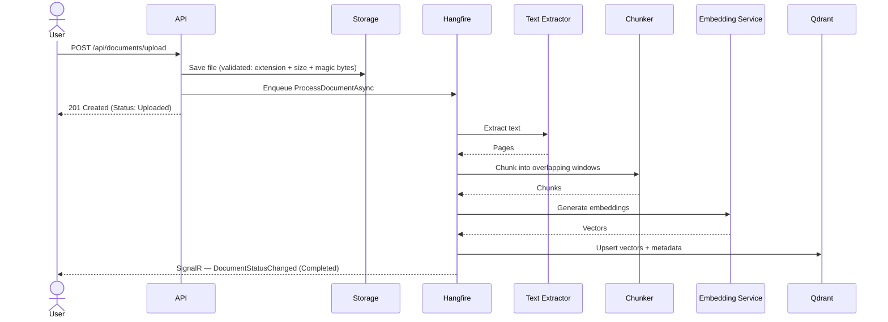
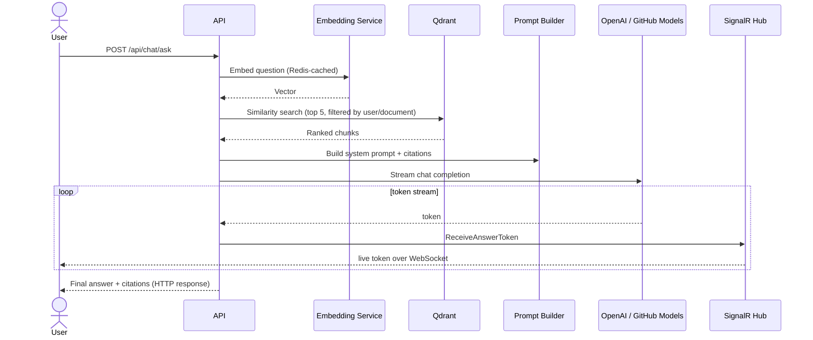
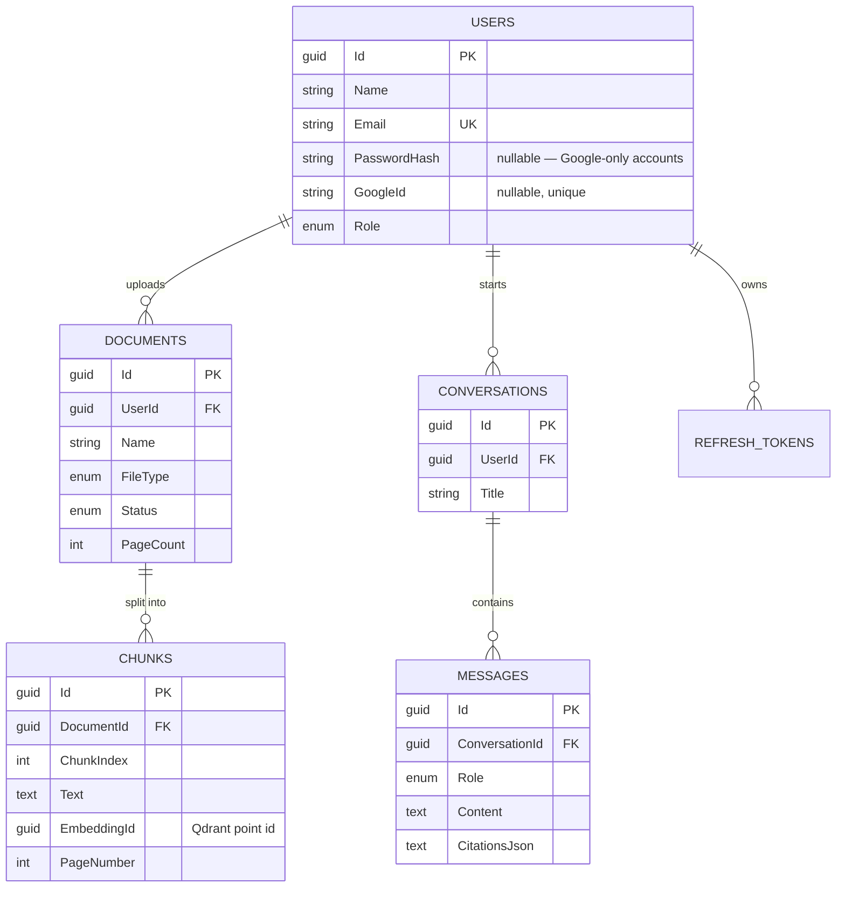
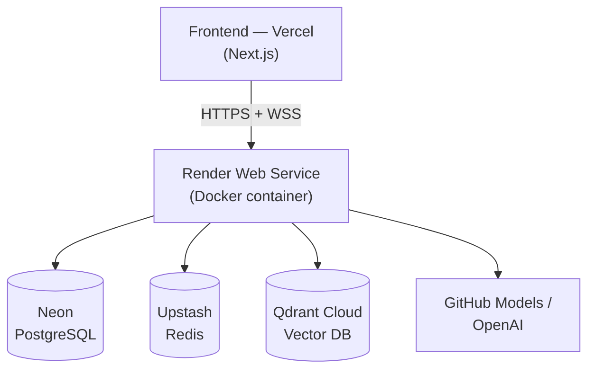

# DocMind AI — Backend

[](https://github.com/ChamathDilshanC/backend-DocMind-AI/actions/workflows/ci.yml)
[](https://dotnet.microsoft.com/)
[](https://github.com/microsoft/semantic-kernel)
[](https://www.docker.com/)
[](LICENSE)

A .NET 8 Clean Architecture + CQRS backend for **DocMind AI** — an AI-powered RAG (Retrieval-Augmented Generation) document assistant. Upload PDF/DOCX files, ask questions grounded only in their content, and get streamed answers with page-level citations.

**Live**: [docmind-ai-api-onsp.onrender.com](https://docmind-ai-api-onsp.onrender.com) — the root path serves a live status/documentation dashboard with real connectivity checks against every dependency below.

Frontend: [`frontend-DocMind-AI`](https://github.com/ChamathDilshanC/frontend-DocMind-AI) · Meta-repo: [`Main-DocMind-AI`](https://github.com/ChamathDilshanC/Main-DocMind-AI)

---

## Tech stack

| Layer | Technology |
|---|---|
| Framework | ASP.NET Core 8, Clean Architecture, CQRS via MediatR |
| AI orchestration | Microsoft Semantic Kernel |
| LLM / embeddings | OpenAI (GPT-4o, `text-embedding-3-small`) — or [GitHub Models](https://github.com/marketplace/models) free tier |
| Vector database | [Qdrant](https://qdrant.tech/) (Qdrant Cloud in production) |
| Relational database | PostgreSQL ([Neon](https://neon.tech) in production), via EF Core |
| Cache | Redis ([Upstash](https://upstash.com) in production) |
| Realtime | SignalR (chat token streaming, document processing progress) |
| Background jobs | Hangfire |
| Auth | JWT + refresh token rotation, Google Sign-In (ID token verification) |
| Validation | FluentValidation |
| Logging | Serilog |
| Container | Docker (multi-stage), deployed on [Render](https://render.com) |

## Architecture

### 1. System overview



### 2. Clean Architecture layering

Dependencies point inward — `API` depends on everything, but `Domain` depends on nothing.



### 3. Document processing pipeline



### 4. RAG chat flow



### 5. Data model



### 6. Deployment architecture



100% free-tier stack — see [`DEPLOYMENT.md`](DEPLOYMENT.md) for the full walkthrough and free-tier caveats (cold starts, ephemeral storage) worth knowing about.

## Docker

The API ships as a multi-stage Docker image — this is what Render actually builds and runs.

```dockerfile
FROM mcr.microsoft.com/dotnet/sdk:9.0 AS build   # matches global.json's pinned SDK
# ...restore (cached via csproj-only COPY first) + publish...
FROM mcr.microsoft.com/dotnet/aspnet:8.0 AS final  # lean runtime image, no SDK
```

- **Two-stage build**: the `sdk:9.0` image (matching the SDK version pinned in `global.json`, even though the app itself targets `net8.0`) compiles and publishes the app; the final image is based on the much smaller `aspnet:8.0` runtime image, which never carries the SDK, compilers, or source code.
- **Cached restore layer**: every `.csproj` is copied and restored *before* the rest of the source, so `dotnet restore` only reruns when a project reference or package actually changes — not on every code edit.
- **Non-root user**: the container runs as an unprivileged `appuser`, not root.
- **Dynamic port binding**: Render assigns a port via the `$PORT` environment variable at container start. The entrypoint maps it into ASP.NET Core's `ASPNETCORE_HTTP_PORTS`:
  ```sh
  export ASPNETCORE_HTTP_PORTS=${PORT:-8080} && exec dotnet DocumentAssistant.API.dll
  ```
  Defaults to `8080` so `docker run -p 8080:8080 <image>` works unchanged for local testing.
- **Ephemeral storage caveat**: `/app/storage` (uploaded documents) and `/app/logs` are *not* persisted across redeploys on Render's free tier — documented in [`DEPLOYMENT.md`](DEPLOYMENT.md).

Build and run it yourself:

```bash
docker build -t docmind-api .
docker run -p 8080:8080 \
  -e ConnectionStrings__DefaultConnection="Host=...;Database=...;Username=...;Password=...;Ssl Mode=Require" \
  -e Redis__ConnectionString="..." \
  -e Qdrant__Host="..." -e Qdrant__ApiKey="..." \
  -e OpenAI__ApiKey="..." \
  -e Jwt__SigningKey="..." \
  docmind-api
```

## API reference

All endpoints are prefixed with the deployment's base URL. See the [live status page](https://docmind-ai-api-onsp.onrender.com) for a browsable version, or `/health` for real-time dependency status.

| Method | Endpoint | Notes |
|---|---|---|
| POST | `/api/auth/register` \| `/login` \| `/google` \| `/refresh` | Public |
| GET | `/api/auth/me` | Auth required |
| POST | `/api/documents/upload` | `multipart/form-data` |
| GET | `/api/documents` \| `/{id}` \| `/{id}/pages` \| `/{id}/download` | |
| DELETE | `/api/documents/{id}` | |
| POST | `/api/chat/ask` | Streams tokens over SignalR while the request is in flight |
| GET | `/api/chat/history` \| `/{conversationId}` | |
| GET | `/api/users` \| `/api/statistics` | Admin role |
| — | `/hubs/app` | SignalR hub (WebSocket) |
| — | `/hangfire` | Background job dashboard, Admin role |
| GET | `/health` | Detailed JSON: Postgres, Redis, Qdrant, AI provider |

## Local development

```bash
# from the root meta-repo, starts Postgres + Qdrant + Redis
docker compose up -d

cd "backend-DocMind AI"
# see appsettings.README.md for required secrets
dotnet run --project src/DocumentAssistant.API
```

Swagger UI is available at `/swagger` in the `Development` environment. See [`appsettings.README.md`](appsettings.README.md) for secrets setup (including a free GitHub Models option so you don't need to pay for OpenAI to test locally).

## Scope

Implements Phases 1–4 of the architecture spec to production quality: authentication (JWT + Google OAuth), document upload and processing, the full Semantic Kernel RAG pipeline with streaming, conversation history with citations, Redis caching, and Hangfire background jobs. Phase 5 and further "future features" (OCR, bots, mobile app, Kubernetes, etc.) are intentionally out of scope — see the [root README](https://github.com/ChamathDilshanC/Main-DocMind-AI#roadmap-not-built-in-this-pass) for the full roadmap.

## License

MIT — see [LICENSE](LICENSE).
